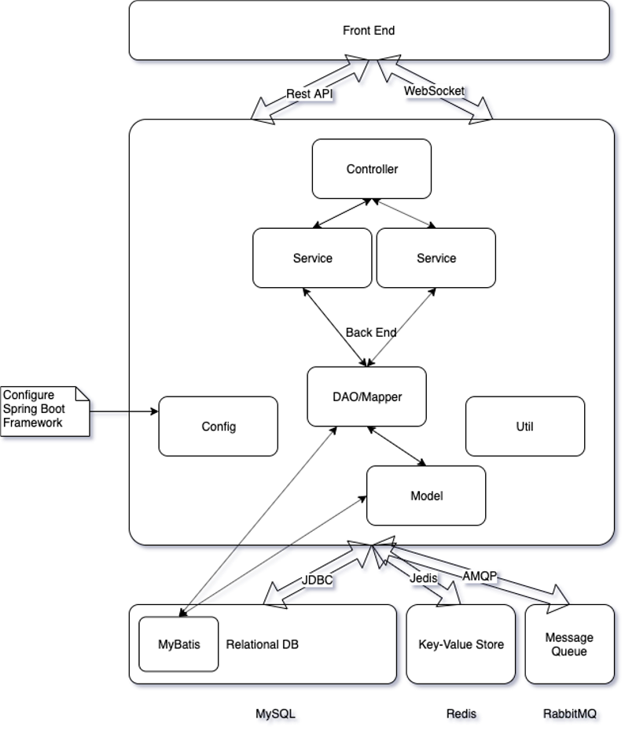
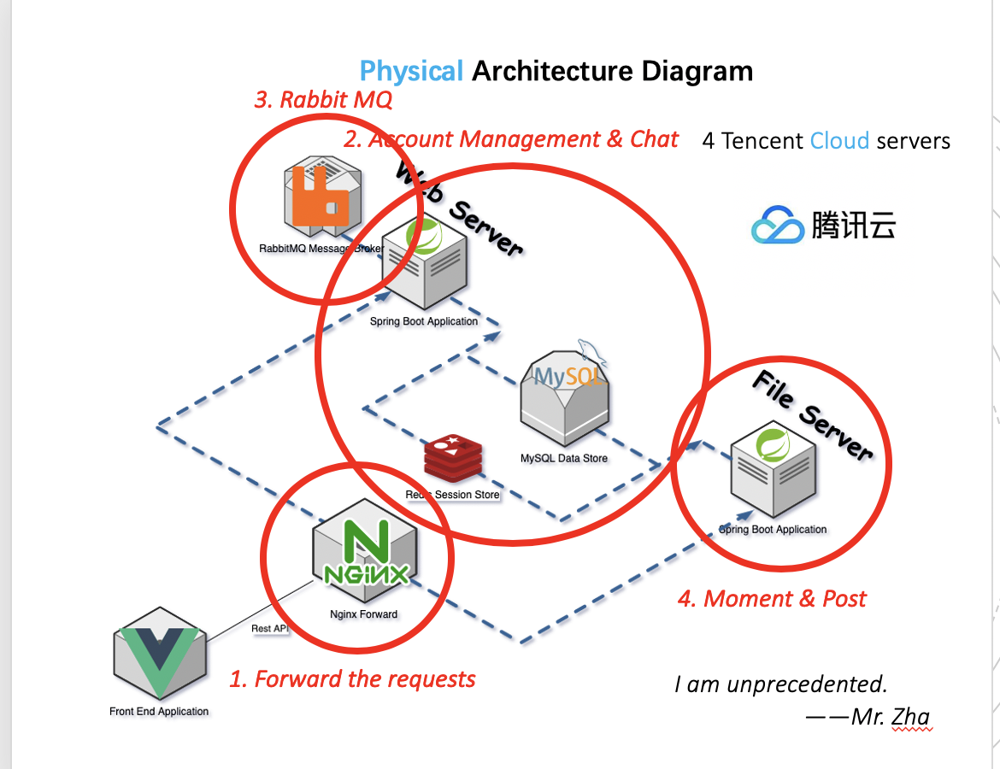
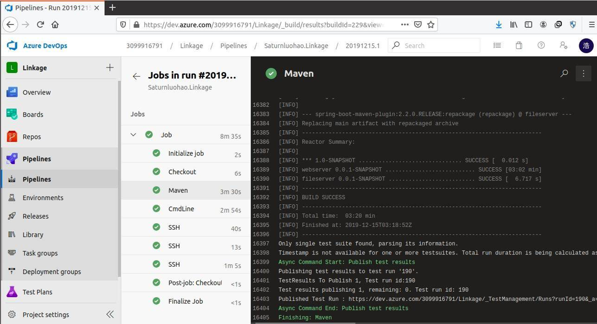

# Linkage
JavaEE 课程设计、软件工程课程设计
## 概述
- 一个账号，两幅面孔（私人社交和公众号）
- 紧急信息（聊天消息通过邮件传递）
## 用例
### 账号管理
- 登录、注册、改密码
- 修改个人信息
- 好友增删查
- 公众号增删查
### Moment（朋友圈）管理
- 创建、查看、删除朋友圈（可包含图片）
- 点赞，评论朋友圈
### Post （公众号文章）管理
- 创建、查看文章（可包含 HTML 格式）
- 点赞、评论文章
### 在线聊天
- 普通聊天（支持未读信息）
- 紧急信息（以邮件发送）
### 热搜
- 查看文章访问量
- 设置热搜榜单
## 系统结构
首先是逻辑视图

而后是物理部署视图

## 开发过程
使用 Azure DevOps

